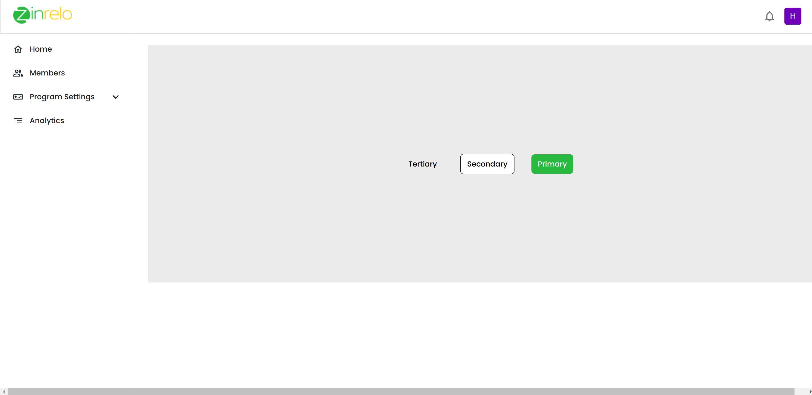

# Material UI Theme Customization POC

Hey there! This project is a proof of concept showcasing how to customize themes using Material UI. 🎨 Let’s dive in and see how we can make our app look fabulous!

## 🎨 Theme Customization

👉 [Check out the Theme File under src/theme.js](src/theme.js)

## 📸 WIP Screenshot

Here’s a sneak peek at what we’ve got so far! 🖼️
  

